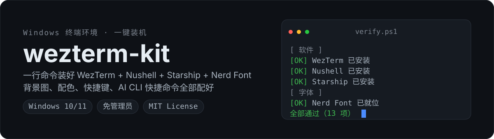
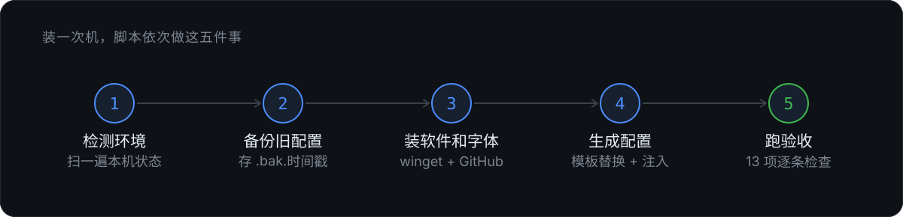
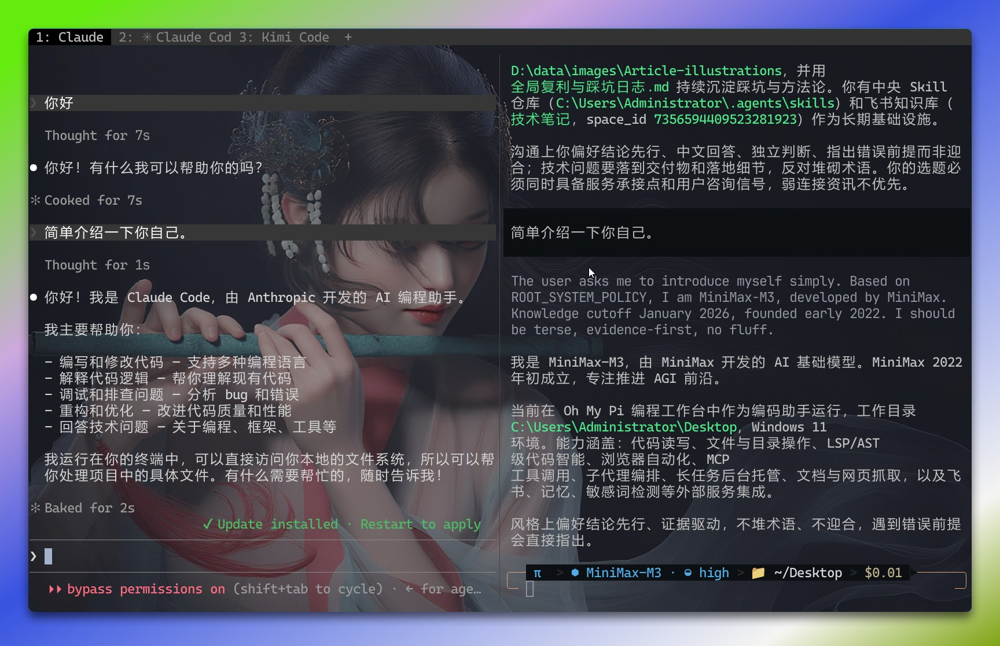

<p align="center">
  
</p>

> 🌐 Other languages: [简体中文](README.zh-CN.md)

One command swaps out that old Windows terminal for a ready-to-use modern environment. Or just hand the repo URL to an AI and let it install everything for you.

---

## What it installs

Four pieces, installed **and wired together**:

| Component | What it does |
|---|---|
| **WezTerm** | Terminal emulator. GPU-accelerated, Lua config, great split panes |
| **Nushell** | Shell. Pipes carry structured data instead of raw text you parse by hand |
| **Starship** | Prompt. git branch, directory, and language versions at a glance |
| **CaskaydiaCove Nerd Font** | Icons and ligatures. Without it the prompt shows empty boxes |

Each piece is easy to install on its own; the hard part is making them cooperate — the font must be picked up by the terminal, the prompt must read its config, splits must inherit the current directory, and AI CLI tools must auto-rename their tab. The script takes care of all that.

---

## What a single run does

<p align="center">
  
</p>

Re-running is harmless: already-installed apps are skipped, config is regenerated from templates every time, and the old config is always backed up before being overwritten.

**Optional pieces are injected on demand** — the background image, proxy, and AI CLI shortcuts are only written when detected, so there are no dangling settings pointing at missing files.

---

## Preview

A WezTerm installed by this kit looks like this: custom tab titles, a semi-transparent background, the Starship prompt, and splits that inherit the working directory.

<p align="center">
  
</p>

---

## Which WezTerm release channel

Pick with `-Channel`. Defaults to **Nightly**.

| Channel | Version | Status |
|---|---|---|
| **Nightly** (default, recommended) | nightly build | Packaged from main every night, with every feature and bug fix since Stable. Ships with an update check that prompts you when a new build is out |
| **Stable** | `20240203-110809-5046fc22` | **No updates since 2024-02** — no bug fixes either. Also the only version winget registers |

Official download page: <https://wezterm.org/install/windows.html>

Fixed Nightly URL (file is overwritten daily, safe to bookmark):

```
https://github.com/wezterm/wezterm/releases/download/nightly/WezTerm-nightly-setup.exe
```

Prefer to install WezTerm yourself first? Click the link above or use the download page's "Windows (setup.exe)", and **install to the default location** — the installer registers "Open WezTerm here" into the Explorer right-click menu. Then run the script with `-SkipApps` to handle only fonts and config.

```powershell
# Nightly by default
.\scripts\install.ps1

# Use the stable release
.\scripts\install.ps1 -Channel Stable
```

---

## Before you start

| Item | Requirement |
|---|---|
| System | Windows 10 1709+ or Windows 11 |
| winget | Built in; used to install Nushell and Starship |
| Admin rights | **Not required** |
| Network | Must reach GitHub (WezTerm 45MB + font 20MB) |
| Pre-step | **Fully quit WezTerm** first, or it won't install |

---

## Method 1: Install it yourself

### 1. Get the repo

```powershell
git clone https://github.com/dqtx760/wezterm-kit.git
cd wezterm-kit
```

No git? Repo page → `Code` → `Download ZIP` → unzip.

### 2. Run the installer

```powershell
powershell -ExecutionPolicy Bypass -File scripts\install.ps1
```

Apps, fonts, and config are all automatic, with the bundled background image enabled by default.

Not sure? Do a dry run first — it only prints what it would do and changes nothing:

```powershell
powershell -ExecutionPolicy Bypass -File scripts\install.ps1 -WhatIf
```

### 3. Verify

```powershell
powershell -ExecutionPolicy Bypass -File scripts\verify.ps1
```

13 checks, one by one; it tells you exactly why if any fail. Exit code 0 means all passed.

### 4. Fully quit and reopen WezTerm

Not just close the window — **quit the process**. Fonts and colors only take effect after a restart.

### Common parameters

```powershell
# Use your own background image
.\scripts\install.ps1 -BackgroundImage "D:\path\to\your.png"

# No background image
.\scripts\install.ps1 -NoBackground

# Configure a proxy
.\scripts\install.ps1 -ProxyPort 7890

# Switch font
.\scripts\install.ps1 -FontName "JetBrainsMono Nerd Font" -FontSize 15

# Regenerate config only, leave apps and fonts alone
.\scripts\install.ps1 -SkipApps -SkipFonts

# Add skip-confirmation flags for cc / cx / gm (use with care — hands execution to the model)
.\scripts\install.ps1 -AiCliAutoAccept
```

| Parameter | What it does | Default |
|---|---|---|
| `-Channel <Nightly\|Stable>` | WezTerm release channel | `Nightly` |
| `-BackgroundImage <path>` | Use your own background image | bundled `assets\background.png` |
| `-NoBackground` | No background image at all | off |
| `-ProxyPort <port>` | Write http/https proxy | no proxy |
| `-FontName <name>` | Change terminal font | `CaskaydiaCove Nerd Font` |
| `-FontSize <number>` | Font size | 14 |
| `-AiCliAutoAccept` | Add skip-confirmation flags for cc/cx/gm | off |
| `-SkipApps` | Skip apps, handle only fonts and config | off |
| `-SkipFonts` | Skip fonts | off |
| `-WhatIf` | Dry run, changes nothing | off |

---

## Method 2: Hand it to an AI

Don't want to type commands? Send the block below together with the repo URL to any AI coding tool (Claude Code, Codex, Cursor, etc.). The `SKILL.md` in the repo is an operation manual written for the AI to follow.

```text
Install a terminal environment on this Windows machine for me. Repo:
https://github.com/dqtx760/wezterm-kit

Follow these steps:
1. Clone the repo locally (or just download and unzip if git isn't installed)
2. Read SKILL.md in the repo and follow its flow — don't improvise
3. Before doing anything, ask me three questions: use the bundled background image
   or a different one, whether to configure a proxy (which port), and whether to
   enable auto-confirm for the AI CLI
4. Run -WhatIf first, show me what it would change, and actually run only after I confirm
5. After installing, run scripts\verify.ps1 and paste the results to me
6. If anything errors mid-way, stop and ask me — don't guess and edit config on your own

Remind me to quit WezTerm if you need it closed.
```

The AI will ask you three questions, then install step by step. You only answer and give a nod on the dry-run output.

---

## Using the software

### Basic operations

WezTerm opens into Nushell by default, with the prompt rendered by Starship.

| What you want | How |
|---|---|
| Open here | Explorer right-click → **Open WezTerm here** |
| Split pane | `Alt+Shift+→` horizontal, `Alt+Shift+↓` vertical |
| Move between panes | `Ctrl+Arrow keys` |
| New tab | `Ctrl+T` |
| Switch tab | `Ctrl+1` ~ `Ctrl+8` |
| Close tab | `Ctrl+W` |
| Quit the whole app | `Ctrl+Shift+W` |
| Paste | Right mouse click |
| Copy | `Shift+Right click` |
| Select text (inside a TUI program) | Hold `Shift` and drag |
| Search scrollback | `Ctrl+Shift+F` |
| Command palette | `Ctrl+Shift+P` |
| Move window | `Ctrl+Left drag` (the title bar is removed) |

> **Don't mix up `Ctrl+W` and `Ctrl+Shift+W`**: `Ctrl+W` closes only the current tab; `Ctrl+Shift+W` closes the entire WezTerm and every tab with it.

New splits **inherit the current directory**, so no `cd` after splitting.

### Full shortcut table

| Shortcut | Action |
|---|---|
| `Alt+Shift+→` / `Alt+Shift+↓` | Horizontal / vertical split |
| `Ctrl+←` `Ctrl+→` `Ctrl+↑` `Ctrl+↓` | Move between panes |
| `Ctrl+W` | Close current tab |
| `Ctrl+Shift+W` | Quit the whole app |
| `Alt+W` | Close current tab (same as `Ctrl+W`, kept for habit) |
| `Ctrl+T` | New tab |
| `Ctrl+1` ~ `Ctrl+8` | Switch to tab 1~8 |
| `Ctrl+U` | Delete to line start |
| Right click | Paste |
| `Shift+Right click` | Copy |
| `Ctrl+Left drag` | Move window |

### Font

It's **CaskaydiaCove Nerd Font** — Microsoft's Cascadia Code (same as VS Code) patched with Nerd Font glyphs, from [ryanoasis/nerd-fonts](https://github.com/ryanoasis/nerd-fonts) v3.5.1.

**Why it's mandatory**: the icons in the prompt — git branch, folder, language, and Powerline arrows — all come from glyphs Nerd Font adds in the Unicode private-use area. A normal font lacks them and shows boxes or question marks.

A few details:

- Installed to the **user-level font folder** (`%LOCALAPPDATA%\Microsoft\Windows\Fonts`) — no admin rights needed
- The config uses the full name `CaskaydiaCove Nerd Font`, but Windows registers the short name `CaskaydiaCove NF` — both point to the same font, so don't think it failed to install when you see the short name in the registry
- Changing the font also requires a **full quit and reopen of WezTerm**

### AI CLI shortcuts

At install time the script scans for AI command-line tools already on the machine and **generates a shortcut only for the ones it finds**. When launched, it renames the WezTerm tab to the matching name, so you can see at a glance what each tab is running.

| Command | Tool |
|---|---|
| `cc` | Claude Code |
| `qw` | Qwen Code |
| `cx` | Codex |
| `gm` | Gemini CLI |

Install a new AI CLI later and re-run `install.ps1` — the new shortcut is added automatically.

### Background image

The repo bundles one (`assets\background.png`), enabled by default. Swap it with `-BackgroundImage`, or drop it entirely with `-NoBackground`.

At install time the image is **copied** to `%LOCALAPPDATA%\wezterm-kit\background.png`, and the config points at that copy — so the background stays even if you delete the cloned repo afterward.

Adjust transparency in the generated `~/.wezterm.lua` via `opacity` (0 = fully transparent, 1 = opaque).

---

## Known limitations

- **Windows only**. Nushell and Starship are cross-platform, but the installer is PowerShell with Windows-specific path handling and font registration
- **Editing `config/` and `snippets/` does nothing**. They're templates and get overwritten on re-run. For lasting customizations, edit the generated files — see [docs/定制.md](docs/定制.md) (Chinese)
- **Nightly reinstalls on every run** (~45MB). It has no fixed version number, so there's no way to tell if it's already the latest
- **Changing the source background image doesn't take effect automatically** — re-run the script or edit the copy
- **WezTerm Stable is stuck at 20240203** with no more bug fixes — which is why Nightly is the default
- **`-AiCliAutoAccept` is off by default** — that switch hands your local execution rights to the model

---

## Directory structure

```
wezterm-kit/
├── SKILL.md                      Operation manual for AI tools
├── README.md                     This file (English)
├── README.zh-CN.md               简体中文版 (Simplified Chinese)
├── assets/
│   ├── background.png            Default background image
│   └── readme/                   Images used in the README
├── config/
│   ├── wezterm/
│   │   ├── wezterm.lua           Main config template
│   │   └── blocks/               Optional blocks: background, proxy
│   ├── nushell/
│   │   ├── config.nu             Main config template
│   │   ├── env.nu
│   │   └── blocks/proxy.nu       Optional block: proxy switch
│   └── starship/starship.toml
├── snippets/                     AI CLI shortcuts, injected by detection
├── scripts/
│   ├── install.ps1               Installer
│   └── verify.ps1                Verifier
└── docs/
    ├── 定制.md
    └── 排错.md
```

---

## Troubleshooting

See [docs/排错.md](docs/排错.md) (Chinese).

## License

MIT

---

## About the author

**Derek Zhao（大强同学）**  
AI tools & workflow practitioner · GitHub open-source author

In real-world Windows, AI Agent, Obsidian, and personal-website scenarios, I turn tools, Skills, and workflows that actually work into reusable open-source projects and deliverables.

- Projects & source: [GitHub @dqtx760](https://github.com/dqtx760)
- Articles & tools: [dqtx.cc](https://www.dqtx.cc/) · [os.dqtx.cc](https://os.dqtx.cc/)
- Follow updates: [Bilibili](https://space.bilibili.com/491358682/upload/video) · [YouTube](https://www.youtube.com/@dqtx760/videos) · [X](https://x.com/dqtx760)
- WeChat official account: search "大强同学" on WeChat


Stuck on install, config, or errors, or want to wire AI into your own workflow? Just reach out.
